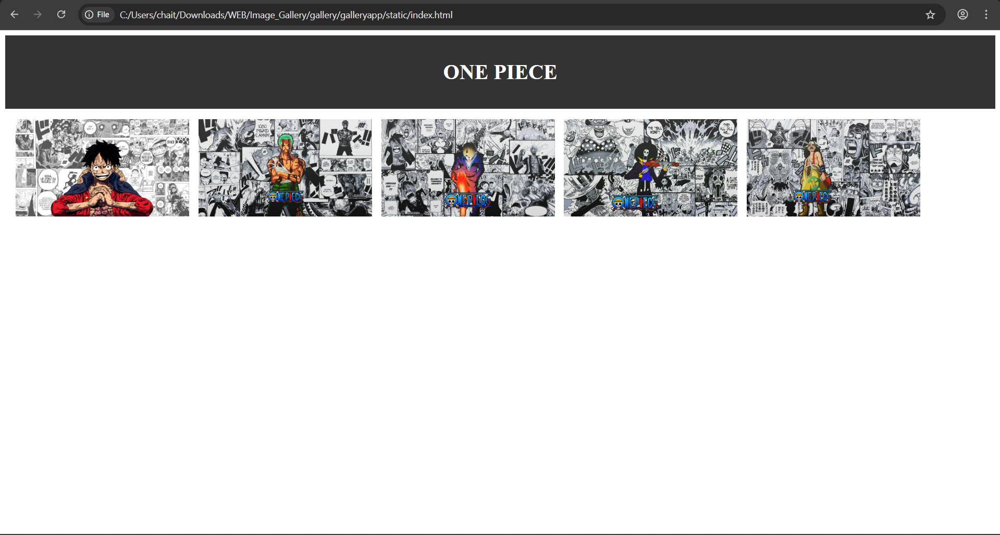
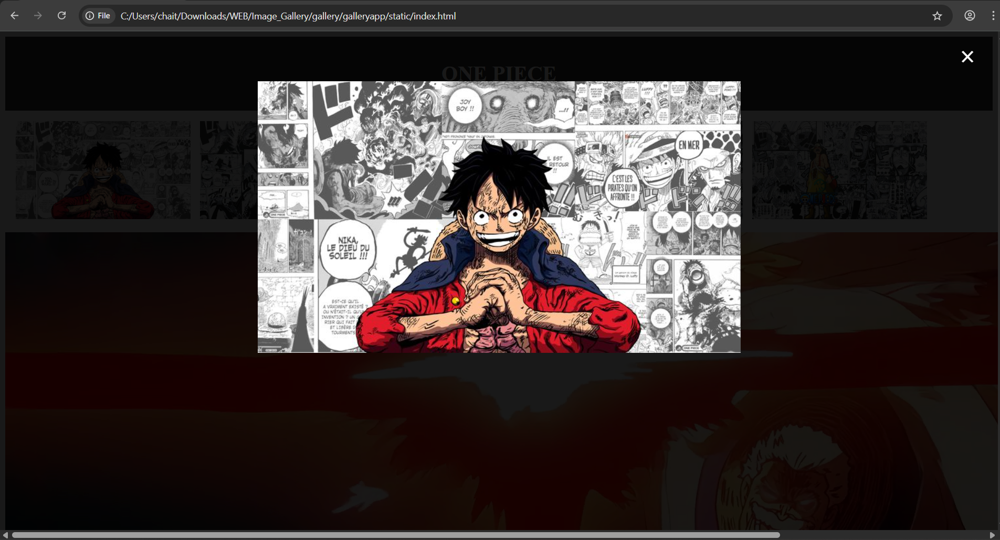

# Ex.08 Design of Interactive Image Gallery
## DATE: 15.11.25
## AIM
  To design a web application for an inteactive image gallery with minimum five images.

## DESIGN STEPS

## Step 1:

Clone the github repository and create Django admin interface

## Step 2:

Change settings.py file to allow request from all hosts.

## Step 3:

Use CSS for positioning and styling.

## Step 4:

Write JavaScript program for implementing interactivit

## Step 5:

Validate the HTML and CSS code

## Step 6:

Publish the website in the given URL.

## PROGRAM
```html
<!DOCTYPE html>
<html lang="en">
<head>
    <meta charset="UTF-8">
    <meta name="viewport" content="width=device-width, initial-scale=1.0">
    <title>Interactive Image Gallery</title>
</head>
<body>
    <header style="text-align: center; background-color: #333; color: white; padding: 1rem 0;">
        <h1>ONE PIECE</h1>
    </header>

    <div style="white-space: nowrap; overflow-x: auto; padding: 1rem;">
        <div style="display: inline-block; margin-right: 10px;" onclick="openModal(this)">
            
        </div>
        <div style="display: inline-block; margin-right: 10px;" onclick="openModal(this)">
            
        </div>
        <div style="display: inline-block; margin-right: 10px;" onclick="openModal(this)">
            
        </div>
        <div style="display: inline-block; margin-right: 10px;" onclick="openModal(this)">
            
        </div>
        <div style="display: inline-block;" onclick="openModal(this)">
            
        </div>
    </div>
    <div id="modal" style="display: none; position: fixed; z-index: 1; left: 0; top: 0; width: 100%; height: 100%; background-color: rgba(0,0,0,0.9);">
        <span style="position: absolute; top: 15px; right: 35px; color: white; font-size: 40px; font-weight: bold; cursor: pointer;" onclick="closeModal()">&times;</span>
        
    </div>
   <body>
    <script>
        function openModal(element) {
            var modal = document.getElementById("modal");
            var modalImg = document.getElementById("modalImage");
            modal.style.display = "block";
            modalImg.src = element.querySelector("img").src;
  }

        function closeModal() {
            document.getElementById("modal").style.display = "none";
        }
    </script>
</body>
</html>
```
```css

body {
    margin: 0;
    font-family: "Segoe UI", Arial, sans-serif;
    background: #f5f6fa;
    color: #fff;
}

#bgVideo {
    position: fixed;
    top: 0;
    left: 0;
    width: 100%;
    height: 100%;
    object-fit: cover;  
    background-size: cover;     
    z-index: -10;            
    filter: brightness(50%) blur(2px); 
}

.video-overlay {
    position: fixed;
    top: 0;
    left: 0;
    width: 100vw;
    height: 100vh;
    background: rgba(0,0,0,0.3);
    z-index: -1;
}

header {
    background: rgba(0, 0, 0, 0.6);
    backdrop-filter: blur(5px);
    color: white;
    text-align: center;
    padding: 1.5rem 0;
    font-size: 2rem;
    font-weight: bold;
    letter-spacing: 2px;
    border-bottom: 2px solid rgba(255, 255, 255, 0.2);
}

.gallery {
    display: flex;
    justify-content: center;
    flex-wrap: wrap;
    gap: 25px;
    padding: 40px 20px;
}

.gallery-item {
    transition: transform 0.3s ease, box-shadow 0.3s ease;
    cursor: pointer;
}

.gallery-item img {
    width: 220px;
    height: auto;
    border-radius: 12px;
    border: 3px solid transparent;
    transition: 0.3s;
}

.gallery-item img:hover {
    transform: scale(1.08);
    box-shadow: 0 8px 18px rgba(0,128,0,0.5);
    border-color: #4CAF50;
}

.gallery-item img.active {
    border-color: #4CAF50;
    transform: scale(1.1);
    box-shadow: 0 0 20px rgba(0,128,0,0.8);
}

.modal {
    display: none;
    position: fixed;
    top: 0; left: 0;
    width: 100vw;
    height: 100vh;
    background: rgba(0,0,0,0.9);
    z-index: 2000;

    display: flex;
    justify-content: center;
    align-items: center;
}

.modal-content {
    width: 85%;
    max-width: 800px;
    border-radius: 12px;
    box-shadow: 0 0 30px rgba(255,255,255,0.3);
}

.close {
    position: absolute;
    top: 25px;
    right: 30px;
    color: white;
    font-size: 50px;
    font-weight: bold;
    cursor: pointer;
    transition: 0.2s;
}

.close:hover {
    color: #4CAF50;
}

#caption {
    margin-top: 15px;
    color: #f0f0f0;
    text-align: center;
    font-size: 20px;
}

@media (max-width: 600px) {
    .gallery-item img {
        width: 150px;
    }

    header {
        font-size: 1.5rem;
    }

    .modal-content {
        width: 95%;
    }
}
```
```js
function openModal(element) {
    const modal = document.getElementById("modal");
    const modalImage = document.getElementById("modalImage");
    const caption = document.getElementById("caption");

    modal.style.display = "flex";
    modalImage.src = element.querySelector("img").src;
    caption.textContent = element.querySelector("img").alt;
}

function closeModal() {
    const modal = document.getElementById("modal");
    modal.style.display = "none";
}
```

## OUTPUT



## RESULT
  The program for designing an interactive image gallery using HTML, CSS and JavaScript is executed successfully.
